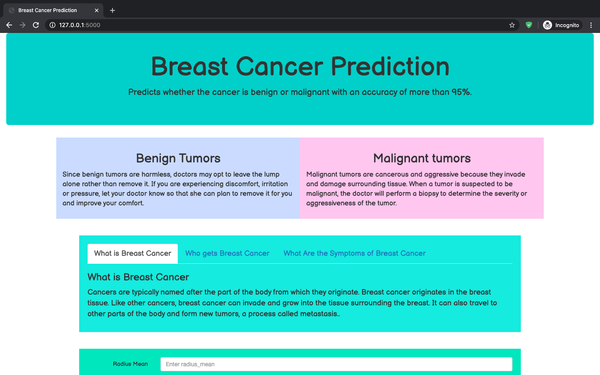
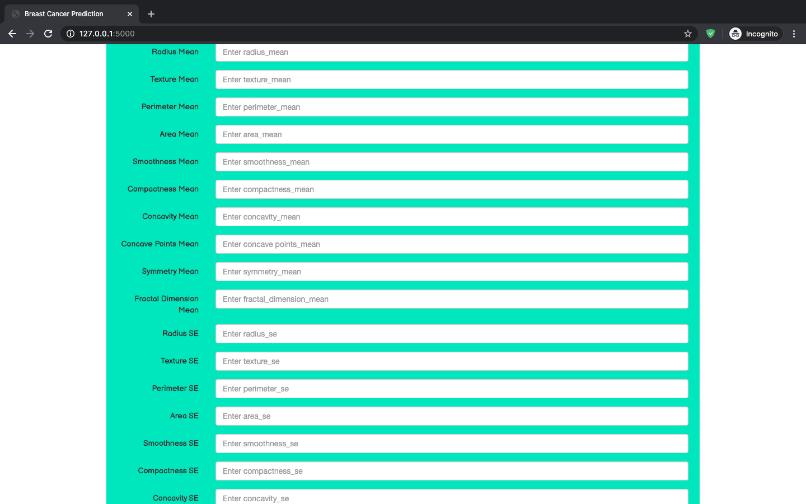
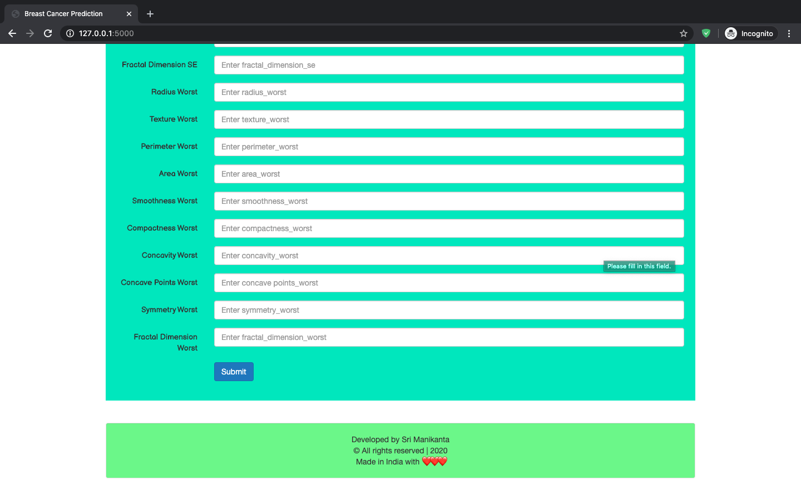

# Breast Cancer Prediction
> Predicts whether the type of breast cancer is Malignant or Benign


[](https://github.com/srimani-programmer/Breast-Cancer-Predictor/blob/master/LICENSE)

## Please follow the Code of Conduct: [Code of Conduct](https://github.com/srimani-programmer/Breast-Cancer-Predictor/blob/master/CODE_OF_CONDUCT.md)
# Aim of the Project
#### > To predict if a breast cancer is Malignant or Benign using Image Dataset as well as Numerical Data
#### > Apply ML and DL Models to predict the severity of the Breast-Cancer
#### > Create a Wonderful UI for this project using Front End Languages and Frameworks (Like Bootstrap)
#### > Create the Backend using Flask Framework.
#### > Deploy on Cloud and make this wonderful project available to public

#### Note: Kindly do not push any changes to Main or Master Branch. A New Branch named "New_Pipeline" is already created and push all the changes to this branch
#### Don't forget to create an issue before making a PR
:point_right: Repo Link : [https://github.com/srimani-programmer/Breast-Cancer-Predictor/](https://github.com/srimani-programmer/Breast-Cancer-Predictor/)

## Table of contents
* [About Project](#about-project)
* [Languages or Frameworks Used](#languages-or-frameworks-used)
* [Setup](#project-setup)
* [Application UI](#Application-ui)

## About Project:

Breast cancer is the most common type of cancer in women. When cancers are found early, they can often be cured. 
Some devices detect breast cancer but many times they lead to false positives, which results 
in patients undergoing painful, expensive surgeries that were not even necessary. These type of cancers are called 
**benign** which do not require surgeries and we can reduce these unnecessary surgeries by using Machine Learning. 
I have taken the dataset of the previous breast cancer patients and train the model to predict whether the cancer is **benign** or **malignant**. These predictions will help doctors to do surgeries only when the cancer is malignant, thus reducing the unnecessary surgeries for women. 
 
For building the project I have used Wisconsin Breast cancer data which has 569 rows of which 357 are benign and 212 are malignant. 
The data is prepossessed and scaled. I have trained with Random forest Classifier gives the best accuracy of 95.0%. To provide an easy-to-use interface to doctors I have developed a website that will take the data and display the output with accuracy and time taken to predict.


## Languages or Frameworks Used 

  * Python: language
  * NumPy: library for numerical calculations
  * Pandas: library for data manipulation and analysis
  * SkLearn: library which features various classification, regression and clustering algorithms
  * Flask: microframework for building web applications using Python.
  
## Project Setup
  
  * First Clone the repository.
  * Create the virtual environment for the project. 
  ```sh
  $ conda create -n myenv python=3.6
  ```
  * Install the required packages using requirements.txt inside the environemnt using pip.
  ```sh
  $ pip install -r requirements.txt
  ```
  * run the app.py as `python app.py`
  * Web Application will be hosted at  `127.0.0.1:5000`
  * Enter the URL in the browser Application will be hosted.
  * Enter the details of the tumor to detect the type of the cancer with more than 95% accuracy.

## Steps to follow :scroll:

### 0. Star The Repo :star2:

Star the repo by pressing the topmost-right button to start your wonderful journey.


### 1. Fork it :fork_and_knife:


### 2. Clone it :busts_in_silhouette:

`NOTE: commands are to be executed on Linux, Mac, and Windows`

You need to clone (download) it to local machine using

```sh
$ git clone https://github.com/Your_Username/Breast-Cancer-Predictor.git
```

> This makes a local copy of the repository in your machine.

Once you have cloned the `Breast-Cancer-Predictor' repository in Github, move to that folder first using change directory command on Linux, Mac, and Windows
```sh
# This will change directory to a folder Hacktoberfest_20
$ cd Breast-Cancer-Predictor
```

Move to this folder for all other commands.

### 3. Set it up :arrow_up:

Run the following commands to see that *your local copy* has a reference to *your forked remote repository* in Github :octocat:

```sh
$ git remote -v
origin  https://github.com/Your_Username/Breast-Cancer-Predictor.git (fetch)
origin  https://github.com/Your_Username/Breast-Cancer-Predictor.git (push)
```

Now, let's add a reference to the original [Breast-Cancer-Predictor](https://github.com/srimani-programmer/Breast-Cancer-Predictor/) repository using

```sh
$ git remote add upstream https://github.com/srimani-programmer/Breast-Cancer-Predictor.git
```

> This adds a new remote named ***upstream***.

See the changes using

```sh
$ git remote -v
origin    https://github.com/Your_Username/Breast-Cancer-Predictor.git (fetch)
origin    https://github.com/Your_Username/Breast-Cancer-Predictor.git (push)
upstream  https://github.com/Remote_Username/Breast-Cancer-Predictor.git (fetch)
upstream  https://github.com/Remote_Username/Breast-Cancer-Predictor.git (push)
```
`In your case, you will see`
```sh
$ git remote -V
origin    https://github.com/Your_Username/Breast-Cancer-Predictor.git (fetch)
origin    https://github.com/Your_Username/Breast-Cancer-Predictor.git (push)
upstream  https://github.com/manan-bedi2908/Breast-Cancer-Predictor.git (fetch)
upstream  https://github.com/manan-bedi2908/Breast-Cancer-Predictor.git (push)
```

### 4. Sync it :recycle:

Always keep your local copy of the repository updated with the original repository.
Before making any changes and/or in an appropriate interval, run the following commands *carefully* to update your local repository.

```sh
# Fetch all remote repositories and delete any deleted remote branches
$ git fetch --all --prune

# Switch to `New_Pipeline` branch
$ git checkout New_Pipeline

# Reset local `main` branch to match the `upstream` repository's `main` branch
$ git reset --hard upstream/main

# Push changes to your forked `Breast-Cancer-Predictor` repo
$ git push -u origin New_Pipeline
```

### 5. Ready Steady Go... :turtle: :rabbit2:

Once you have completed these steps, you are ready to start contributing to the project and creating [pull requests](https://github.com/srimani-programmer/Breast-Cancer-Predictor/pulls).

### 6. Checkout to a new branch :bangbang:

Whenever you are going to contribute. Please create a separate branch using command and keep your `main` branch clean (i.e. synced with remote branch).

```sh
# It will create a new branch with name Branch_Name and switch to branch Folder_Name
$ git checkout -b New_Pipeline
```

Create a separate branch for contribution and try to use the same name of the branch as of folder.

To switch to the desired branch

```sh
# To switch from one folder to other
$ git checkout New_Pipeline
```

To add the changes to the branch. Use

```sh
# To add all files to branch Folder_Name
$ git add .
```

Type in a message relevant for the code reviewer using

```sh
# This message get associated with all files you have changed
$ git commit -m 'relevant message'
```

Now, Push your awesome work to your remote repository using

```sh
# To push your work to your remote repository
$ git push -u origin New_Pipeline
```


(Kindly push all the changes to the "New_Pipeline", not main branch)
Finally, go to your repository in the browser and click on `compare and pull requests`.
Then add a title and description to your pull request that explains your precious effort.


*****

<div align="center">
<h4>Application UI</h4>
</div>

<div align="center">
<p>Home Page</p>
</div>



***** 

<div align="center">
<p>Tumor Data form</p>
</div>



*****
<div align="center">
<p>Tumor Data form</p>
</div>



***
<div align="center">
<p>Prediction Output</p>
</div>


## Awesome contributors :star_struck:
<a href="https://github.com/srimani-programmer/Breast-Cancer-Predictor/graphs/contributors">
  
</a>

Made with [contributors-img](https://contributors-img.web.app).
